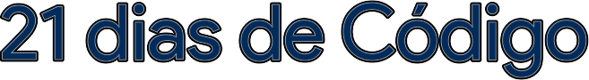

  

  
  
  
  

 

## 📌 Sobre

Repositório para armazenar os 21 desafios propostos pela Rocketseat.

 

## ✨ Regra

- Codar pelo menos uma hora por dia.
- Compartilhar todos os dias o progresso.

 

## 🚀 Dia 01 - Criação do repositório

 

## 🚀 Dia 02 - Hello Word

- Fazer um Hello World customizado com fontes, cores e imagens.

 

## 👩‍💼 Autora

<b>Nádia Ligia, budding back-end developer.</b>

&nbsp;
&nbsp;

